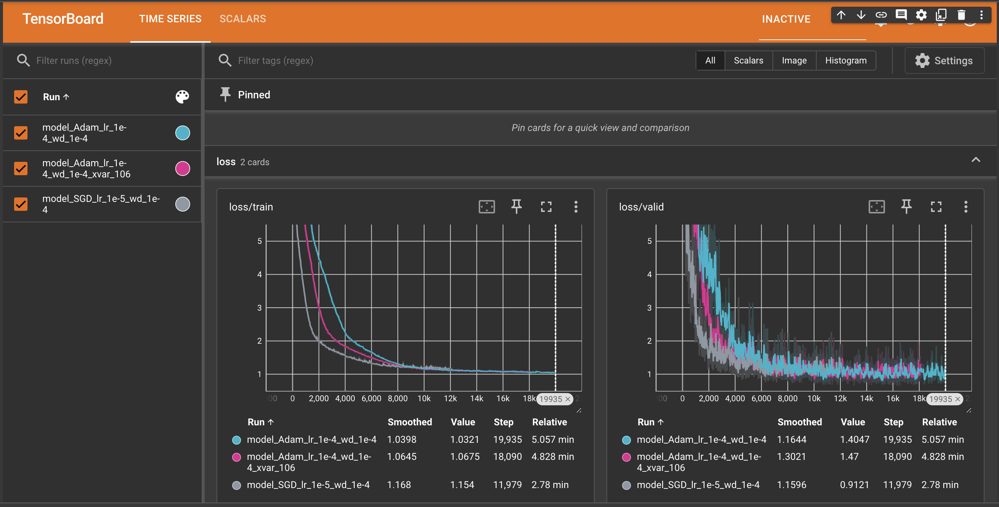

# COVID_Positive_Prediction
</img>
- code refers to [here](https://github.com/virginiakm1988/ML2022-Spring)
## Latest Result
- model_SGD_lr_1e-5_wd_1e-4: optimizer: SGD / learning_rate:1e-5 / weight_decay:1e-4
- model_Adam_lr_1e-4_wd_1e-4: optimizer: Adam / learning_rate:1e-4 / weight_decay:1e-4
- model_Adam_lr_1e-4_wd_1e-4_xvar_106: Adam / learning_rate:1e-4 / weight_decay:1e-4 / excluded_features: travel_outside_state&public_transit
</img>
